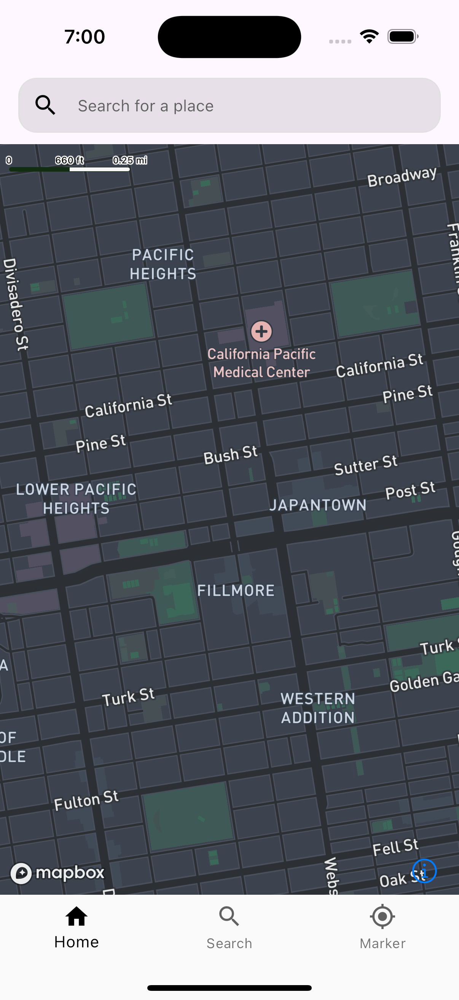

# Mapbox Example

A complete open-source Flutter project demonstrating how to integrate and use Mapbox in your applications.

## Features
- Display interactive maps powered by Mapbox.
- Customize map styles, markers, and labels.
- Demonstrate real-time location updates and map interactions.

## Getting Started
1. Clone this repository.
2. Run `flutter pub get` to install dependencies.
3. Replace `YOUR_MAPBOX_ACCESS_TOKEN` in the code with your own Mapbox token.
4. Run `flutter run` to launch on your device or simulator.

## Screenshots

 | Page | Page
|---|---|
|  | 

## Contributing
Feel free to submit issues and pull requests. Contributions are welcome!

---